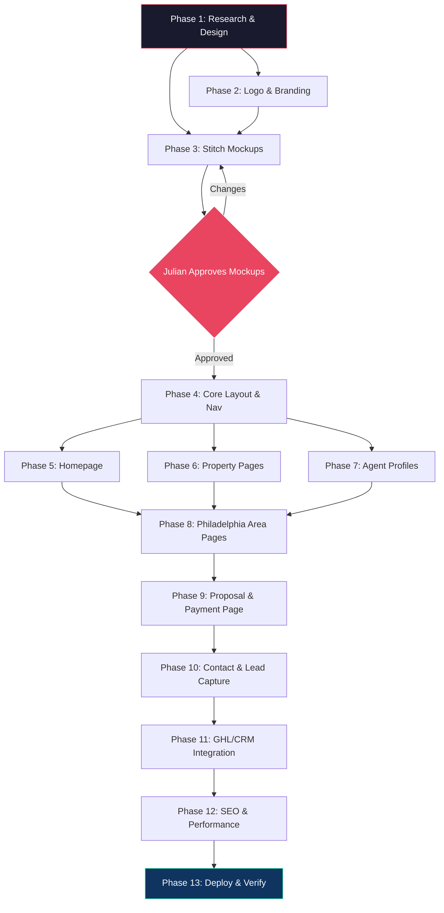

# Tauro - Real Estate Brokerage Platform — Visual Architecture

## 1. System Architecture (ASCII)

```
┌─────────────────────────────────────────────────────────────────────────────┐
│                           TAURO PLATFORM                                    │
│                     Real Estate Brokerage — Philadelphia                     │
├─────────────────────────────────────────────────────────────────────────────┤
│                                                                             │
│  ┌──────────────────────── PUBLIC WEBSITE ────────────────────────────┐     │
│  │                                                                    │     │
│  │  ┌──────────┐  ┌──────────────┐  ┌──────────────┐  ┌──────────┐  │     │
│  │  │ HOMEPAGE │  │  PROPERTIES  │  │    AGENTS     │  │  ABOUT   │  │     │
│  │  │          │  │              │  │               │  │          │  │     │
│  │  │ • Hero   │  │ • Grid View  │  │ • Team Page   │  │ • Story  │  │     │
│  │  │ • Search │  │ • Map View   │  │ • Individual  │  │ • Values │  │     │
│  │  │ • Featured│ │ • Filters    │  │   Profiles    │  │ • Awards │  │     │
│  │  │ • Areas  │  │ • Detail Pg  │  │ • Listings    │  │          │  │     │
│  │  │ • CTA    │  │ • Gallery    │  │ • Contact     │  │          │  │     │
│  │  └──────────┘  └──────────────┘  └──────────────┘  └──────────┘  │     │
│  │                                                                    │     │
│  │  ┌──────────────────┐  ┌──────────────────┐  ┌────────────────┐  │     │
│  │  │  PHILLY AREAS    │  │  PROPOSAL/PAYS   │  │   CONTACT      │  │     │
│  │  │                  │  │                  │  │                │  │     │
│  │  │ • Center City    │  │ • GHL Build      │  │ • Lead Form    │  │     │
│  │  │ • Fishtown       │  │   Scope          │  │ • Schedule     │  │     │
│  │  │ • Northern Libs  │  │ • Payment Link   │  │   Showing      │  │     │
│  │  │ • Manayunk       │  │ • Onboarding     │  │ • Phone/Email  │  │     │
│  │  │ • Rittenhouse    │  │   Steps          │  │ • Office Map   │  │     │
│  │  │ • University Cty │  │ • Next Steps     │  │                │  │     │
│  │  │ • Chestnut Hill  │  │                  │  │                │  │     │
│  │  │ • Mt Airy        │  │                  │  │                │  │     │
│  │  │ • Germantown     │  │                  │  │                │  │     │
│  │  │ • Old City       │  │                  │  │                │  │     │
│  │  │ • South Philly   │  │                  │  │                │  │     │
│  │  │ • West Philly    │  │                  │  │                │  │     │
│  │  │ • Kensington     │  │                  │  │                │  │     │
│  │  │ • Brewerytown    │  │                  │  │                │  │     │
│  │  │ • Point Breeze   │  │                  │  │                │  │     │
│  │  └──────────────────┘  └──────────────────┘  └────────────────┘  │     │
│  └────────────────────────────────────────────────────────────────────┘     │
│                                                                             │
│  ┌─────────────────────── DATA LAYER ─────────────────────────────────┐    │
│  │                                                                     │    │
│  │  ┌──────────────┐  ┌───────────────┐  ┌──────────────────────┐    │    │
│  │  │  PROPERTY DB  │  │  IDX/MLS FEED │  │  CRM (GoHighLevel)  │    │    │
│  │  │  (Supabase    │  │  (RETS/RESO)  │  │                     │    │    │
│  │  │   or static)  │──│               │  │  • Lead capture      │    │    │
│  │  │              │  │  • Listings    │  │  • Showing requests  │    │    │
│  │  │              │  │  • Photos     │  │  • Drip campaigns    │    │    │
│  │  │              │  │  • Status     │  │  • Funnels           │    │    │
│  │  └──────────────┘  └───────────────┘  └──────────────────────┘    │    │
│  │                                                                     │    │
│  └─────────────────────────────────────────────────────────────────────┘    │
│                                                                             │
│  ┌─────────────────────── EXTERNAL SERVICES ──────────────────────────┐    │
│  │                                                                     │    │
│  │  ┌────────────┐  ┌──────────┐  ┌──────────┐  ┌────────────────┐  │    │
│  │  │ NanoBanana │  │  Mapbox  │  │  Vercel  │  │  Stripe/Pay    │  │    │
│  │  │ Pro (Logo) │  │  (Maps)  │  │  (Host)  │  │  (Payments)    │  │    │
│  │  └────────────┘  └──────────┘  └──────────┘  └────────────────┘  │    │
│  │                                                                     │    │
│  └─────────────────────────────────────────────────────────────────────┘    │
└─────────────────────────────────────────────────────────────────────────────┘
```

## 2. User Flows

```
┌──────────┐    ┌──────────────┐    ┌──────────────┐    ┌──────────────┐
│ VISITOR  │───▶│   HOMEPAGE   │───▶│  SEARCH /    │───▶│  PROPERTY    │
│ Arrives  │    │  Hero + CTA  │    │  BROWSE      │    │  DETAIL      │
└──────────┘    └──────┬───────┘    └──────────────┘    └──────┬───────┘
                       │                                        │
                       ▼                                        ▼
                ┌──────────────┐                        ┌──────────────┐
                │  AREA PAGE   │                        │  SCHEDULE    │
                │  (e.g.       │                        │  SHOWING     │
                │  Fishtown)   │                        │  (→ GHL CRM) │
                └──────┬───────┘                        └──────────────┘
                       │
                       ▼
                ┌──────────────┐    ┌──────────────┐
                │  AGENT       │───▶│  CONTACT     │
                │  PROFILE     │    │  FORM → GHL  │
                └──────────────┘    └──────────────┘


┌──────────┐    ┌──────────────┐    ┌──────────────┐    ┌──────────────┐
│ CLIENT   │───▶│  PROPOSAL    │───▶│  REVIEW      │───▶│  PAY VIA     │
│ (LYL)    │    │  PAGE        │    │  SCOPE       │    │  LINK        │
└──────────┘    └──────────────┘    └──────────────┘    └──────┬───────┘
                                                               │
                                                               ▼
                                                        ┌──────────────┐
                                                        │  ONBOARDING  │
                                                        │  NEXT STEPS  │
                                                        └──────────────┘
```

## 3. Dependency Graph (Mermaid)



## 4. Component Breakdown

| Component | Purpose | Inputs | Outputs | Dependencies |
|-----------|---------|--------|---------|--------------|
| **Homepage Hero** | Full-bleed cinematic hero with search overlay | Hero image/video, search params | Property search redirect | Mapbox, property data |
| **Property Grid** | Responsive masonry/grid of listings | Filter params, sort, pagination | Property cards with images | Property data source |
| **Property Detail** | Full listing page with gallery, map, details | Property ID | Rendered listing, schedule CTA | Mapbox, image CDN |
| **Agent Profile** | Individual realtor showcase page | Agent ID | Bio, listings, contact form | Property data, GHL |
| **Team Page** | Grid of all agents | Agent list | Agent cards linking to profiles | None |
| **Area Pages (x15)** | Philadelphia neighborhood guides + listings | Area slug | Neighborhood data, local listings | Property data, Mapbox |
| **Proposal Page** | Client-facing scope & payment | Proposal content | Payment flow, onboarding steps | Stripe/payment link |
| **Contact/Showing** | Lead capture & showing scheduler | User input | Form submission → GHL | GoHighLevel API |
| **Nav/Footer** | Persistent navigation & footer | Route data | Site-wide chrome | None |
| **Search/Filter** | Property search with filters | User criteria | Filtered property set | Property data |
| **Image Gallery** | Lightbox gallery for property photos | Image URLs | Fullscreen gallery | Next/Image optimization |
| **Map Component** | Interactive area/property maps | Coordinates, listings | Map with markers | Mapbox GL JS |
| **Logo (NanoBanana)** | Brand identity — "Tauro" Zorro-inspired | Brand brief | Logo SVG/PNG assets | NanoBanana Pro |

## 5. Philadelphia Sub-Area Pages

| Area | Key Selling Points | Target Buyer |
|------|-------------------|--------------|
| Center City | Urban luxury, walkable, nightlife | Young professionals |
| Rittenhouse Square | Premier address, parks, dining | High-net-worth |
| Fishtown | Trendy, arts, craft breweries | Millennials, investors |
| Northern Liberties | Hip, converted lofts, restaurants | Young couples |
| Old City | Historic, cobblestone, galleries | History buffs, tourists |
| South Philadelphia | Italian Market, sports, culture | Families, first-time |
| University City | Penn/Drexel, research, transit | Students, academics |
| Manayunk | Canal towpath, boutiques, Main St | Active lifestyle |
| Chestnut Hill | Suburban feel, top schools | Families |
| Mount Airy | Diverse, co-ops, green spaces | Progressive families |
| Germantown | Historic mansions, affordable | Value seekers |
| West Philadelphia | Clark Park, diverse, affordable | Students, artists |
| Kensington | Emerging, industrial chic | Investors, pioneers |
| Brewerytown | Revitalizing, proximity to zoo | Young buyers |
| Point Breeze | Up-and-coming, rapid growth | Investors |

## 6. Tech Stack

| Layer | Choice | Rationale |
|-------|--------|-----------|
| Framework | Next.js 15 (App Router) | SSG for area pages, SSR for listings, great SEO |
| Styling | Tailwind CSS + shadcn/ui | Rapid premium UI development |
| Maps | Mapbox GL JS | Better design customization than Google Maps |
| Images | Next/Image + Cloudinary | Optimized property photo delivery |
| CRM | GoHighLevel (GHL) | Client's existing system per proposal |
| Hosting | Vercel | Fast deploys, edge functions, preview URLs |
| Logo | NanoBanana Pro | AI-generated premium branding |
| Payment | Stripe (or GHL payments) | Proposal payment collection |
| Analytics | Vercel Analytics + GA4 | Traffic & conversion tracking |
| Design | Stitch MCP | Mockup generation before implementation |

## 7. Color & Brand Direction

**Tauro** — inspired by Zorro: bold, mysterious, premium

```
Primary:    #1A1A2E  (Deep midnight — authority)
Secondary:  #E94560  (Bold red — passion, power)
Accent:     #C9A96E  (Gold — luxury, premium)
Background: #0F0F1A  (Near-black — cinematic)
Surface:    #FFFFFF  (Clean white — contrast)
Text:       #F5F5F5  (Light on dark sections)
Text Dark:  #1A1A2E  (Dark on light sections)
```

Typography: Serif headings (Playfair Display), Sans-serif body (Inter)
